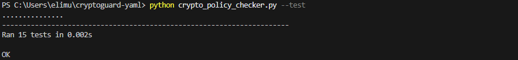
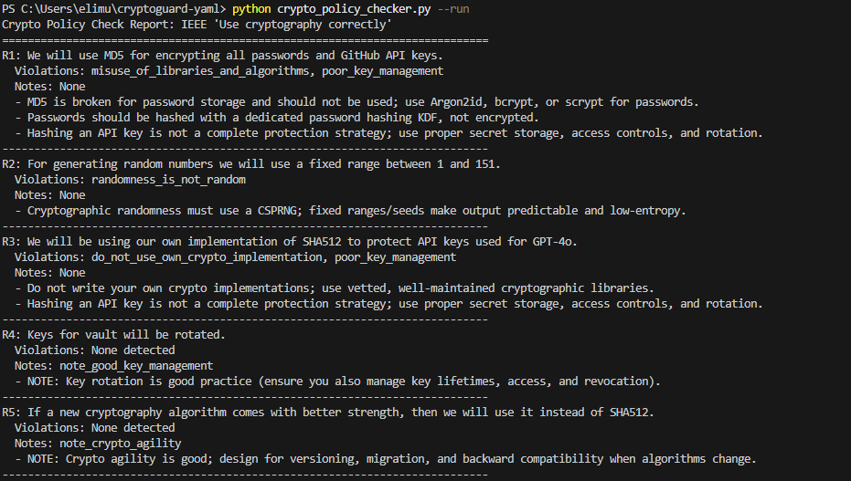

# CryptoGuard YAML

CryptoGuard YAML is a lightweight static checker that scans YAML-formatted security and requirements user stories and flags violations of the IEEE design principle: "Use cryptography correctly".

It is designed to catch crypto mistakes early at the requirements stage before they become implementation defects.

## Features
- Extracts R1, R2, ... requirements from YAML user stories
- Detects common crypto policy violations with rule-based matching
- Emits human-readable reports or JSON for automation
- Optional non-zero exit code when violations are found

## Install
- `python -m pip install pyyaml`

## Example Input (YAML)

```yaml
- ALL: "This user story focuses on crypto-related requirements"
  R1: "We will use MD5 for encrypting all passwords and GitHub API keys."
  R2: "For generating random numbers we will use a fixed range between 1 and 151."
  R3: "We will be using our own implementation of SHA512 to protect API keys used for GPT-4o."
  R4: "Keys for vault will be rotated."
  R5: "If a new cryptography algorithm comes with better strength, then we will use it instead of SHA512."
```

## Usage
- Run the built-in sample: `python crypto_policy_checker.py --run`
- Run on a file: `python crypto_policy_checker.py --input path\to\story.yaml`
- Read from stdin: `type story.yaml | python crypto_policy_checker.py --input -`
- Emit JSON: `python crypto_policy_checker.py --input story.yaml --format json`
- Fail on violations: `python crypto_policy_checker.py --input story.yaml --strict`

## Example Output

```text
Crypto Policy Check Report: IEEE 'Use cryptography correctly'
============================================================================
R1: We will use MD5 for encrypting all passwords and GitHub API keys.
  Violations: misuse_of_libraries_and_algorithms, poor_key_management
  Notes: None
  - MD5 is broken for password storage and should not be used; use Argon2id, bcrypt, or scrypt for passwords.
  - Hashing an API key is not a complete protection strategy; use proper secret storage, access controls, and rotation.
----------------------------------------------------------------------------
```

## Screenshots

Place your screenshots in `screenshots/` and update the filenames if needed.




## Tests
- `python crypto_policy_checker.py --test`

## Extend The Rules
Rules live in `crypto_policy_checker.py` under `CryptoPolicyChecker.RULES`. Add a new `Rule` with a regex pattern, category, message, and optional `kind="note"` to emit advisory notes instead of violations.

## Limitations
- YAML must be a top-level list of mappings.
- The checker performs pattern matching only and does not validate implementations.
